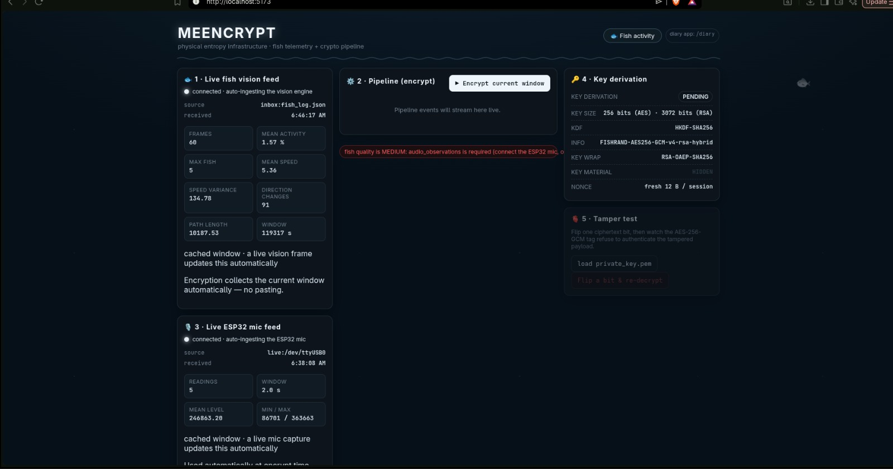
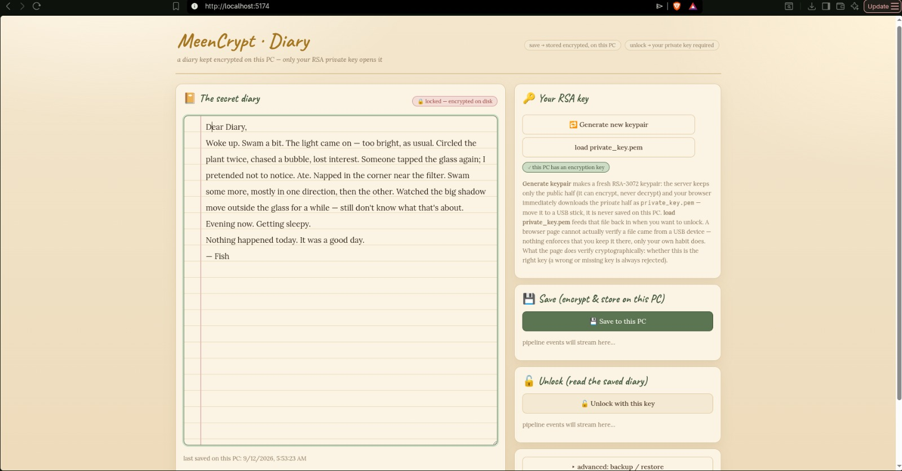
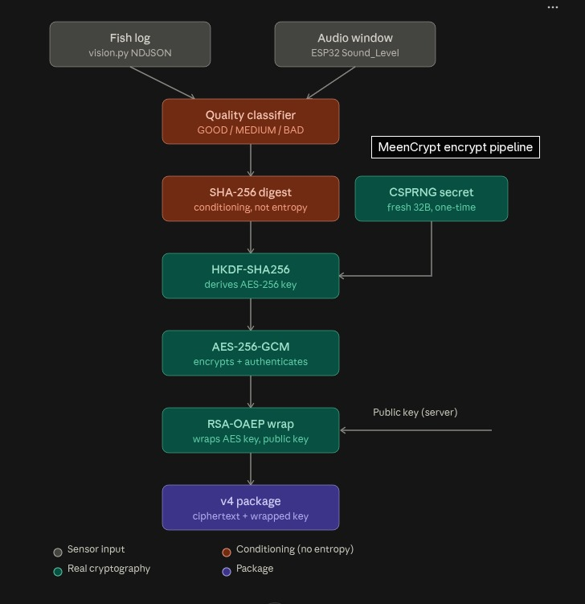

# MeenCrypt 🎯

## Basic Details

### Team Name: FISHRAND

### Team Members
- Team Lead: Abijit Arun (`abijit2626`) - [College]
- Member 2: Sreelal VS (`archSLAYER44`) - [College]

### Project Description
Your secrets are safe with 🐟 — MeenCrypt encrypts a diary using measurements
of a fishs swimming around its tank (with an optional ESP32 microphone
listening in). The secret is real (AES-256-GCM wrapped by an RSA-3072 public
key); the fish only *conditions* the key with the moment it watched — it is
honestly not an entropy source, and the code, README and UI all say so.

### The Problem (that doesn't exist)
Your diary has a security budget but zero emotional connection. Every ordinary
password manager just encrypts your secrets — no security product actually
*bonds* with you. What your diary really needs, clearly, is a pet that guards
it.

### The Solution (that nobody asked for)
MeenCrypt. A fish swims, OpenCV tracks it, an ESP32 mic overhears the tank,
and we fold *this tank, this exact moment* into an AES-256-GCM session key. The
key is wrapped with your RSA-3072 keypair and the private half lives on a USB
drive only you hold. The honest twist: the fish adds exactly zero entropy — the
OS CSPRNG and the RSA key do all the real work. The fish just signs its own
work, and the app tells you so.

## Technical Details

### Technologies/Components Used
For Software:
- **Languages:** Python · JavaScript (React)
- **Frameworks:** FastAPI (server + SSE) · React / Vite (two web apps)
- **Libraries:** `cryptography` (AES-256-GCM, RSA-OAEP) · OpenCV (fish vision) · pyserial (ESP32 audio) · numpy
- **Tools:** git · `run.sh` one-command orchestration · pytest (206 test functions)

For Hardware:
- **Components:** fishs + tank, webcam or phone (droidcam), ESP32 + INMP441 I2S microphone
- **Specifications:** ESP32 UART 115200 baud · INMP441 I2S (WS=GPIO14, SCK=GPIO15, SD=GPIO32, 16 kHz)
- **Tools:** a USB drive (the private key lives there), plus any webcam the vision tracker can see a fish with

### Implementation
For Software:

# Installation
```bash
git clone https://github.com/abijit2626/MeenCrypt.git
cd MeenCrypt
python3 -m venv .venv
.venv/bin/pip install -r requirements.txt -r requirements-vision.txt
```

# Run
```bash
# 1. make the keypair once — keep the private half on a USB stick
python cli.py keygen --output /media/USB/fishrand

# 2. full demo: vision tracker + server + dashboard (5173) + diary (5174)
./run.sh --web --camera-index 2
#    dashboard -> http://localhost:5173   diary -> http://localhost:5174
#    server    -> http://localhost:8000

# 3. encrypt / decrypt from the CLI
python cli.py encrypt --diary examples/diary.txt \
    --public-key /media/USB/fishrand/public_key.pem --out diary.pkg
python cli.py decrypt --pkg diary.pkg \
    --private-key /media/USB/fishrand/private_key.pem

# 4. stop everything
./run.sh --stop
```

### Project Documentation
For Software:

Deep dive: see [`documentary/how-it-was-built.md`](documentary/how-it-was-built.md) — the full engineering story behind the fish, the honest security model, and how it got here.

# Screenshots (Add at least 3)

*The dashboard (`localhost:5173`) — live fish telemetry and the crypto pipeline streaming as structured events.*


*The diary app (`localhost:5174`) — write → encrypt → download your `.pkg`, unlock it back with the private key.*


*The OpenCV vision tracker — live fish detection, bounding boxes, trails and the activity sparkline.*

# Diagrams

*Fish vision + ESP32 audio → quality classifier → SHA-256 conditioning → HKDF(AES session key) → AES-256-GCM + RSA-OAEP wrap → v4 package, decryptable only with the RSA private key.*

### Project Demo
# Video
[Add your demo video link here]
*A short walkthrough of the whole demo: camera finds the fish, the dashboard streams the pipeline while encrypting a diary entry, and the `.pkg` unlocks back on a different machine using the USB key.*

# Additional Demos
[Add any extra demo materials/links]

## Team Contributions
- **Abijit Arun (`abijit2626`):** `fishrand/` crypto core (schema, canonicalization, entropy conditioning, HKDF, AES-256-GCM, RSA-OAEP hybrid, package format), the v4 CLI, the vision tracker, and the honest security model.
- **Sreelal VS (`archSLAYER44`):** FastAPI server + SSE pipeline, both React apps (`dashboard` + `diary`), ESP32/INMP441 audio capture, and `run.sh` orchestration.

---
Made with ❤️ at TinkerHub Useless Projects


